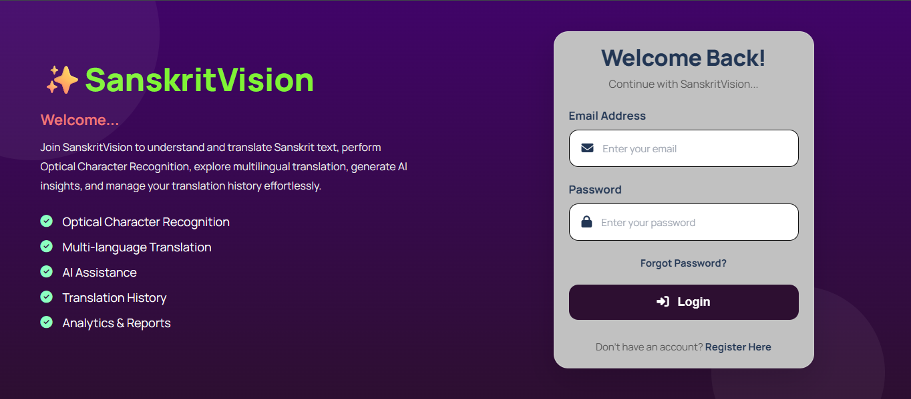
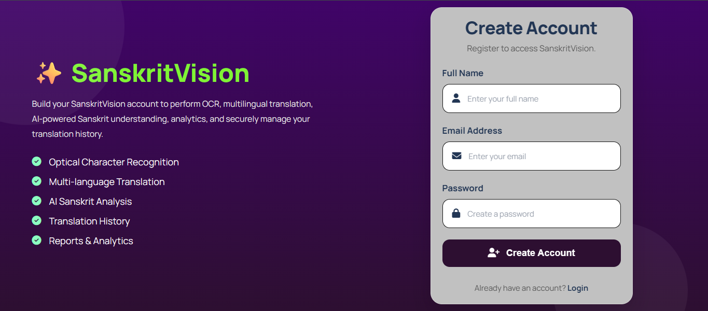
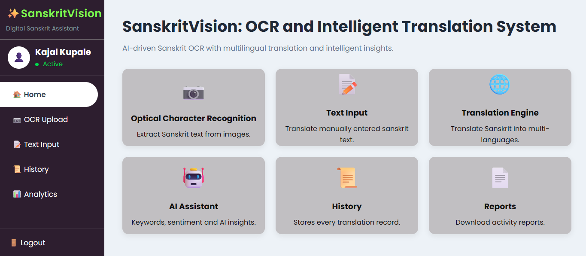
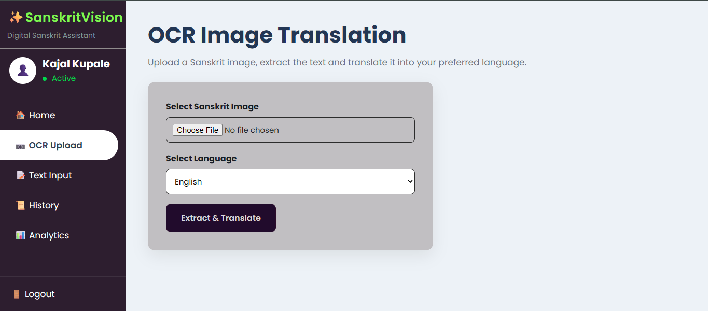
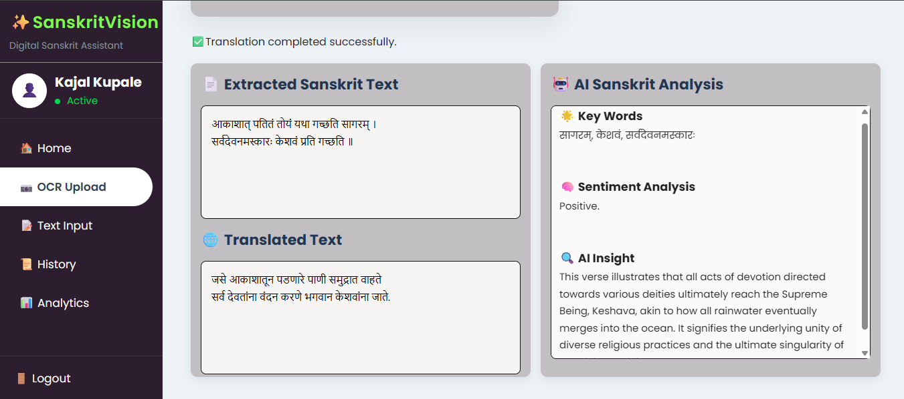
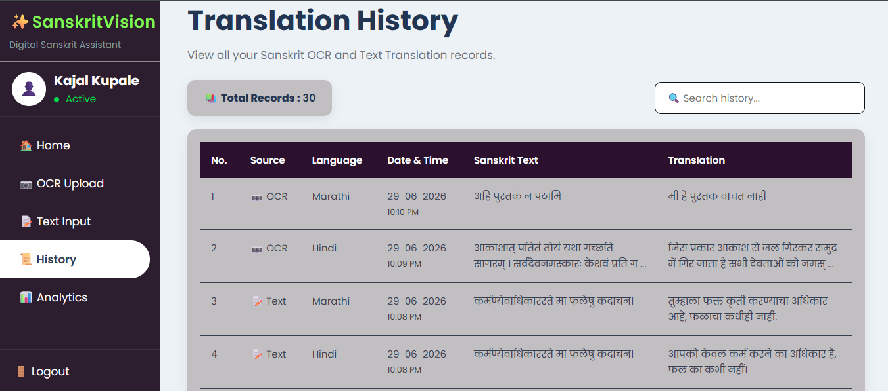
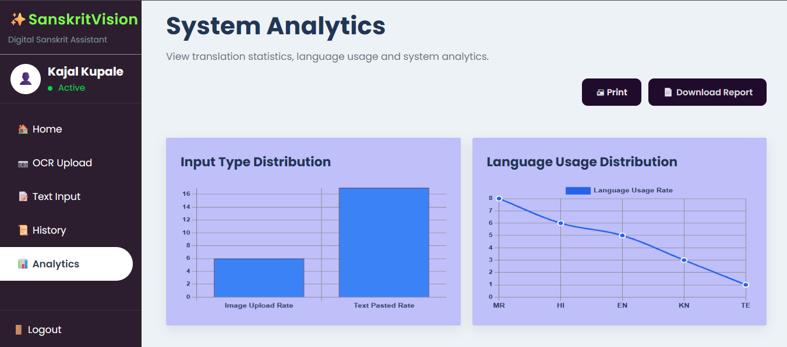
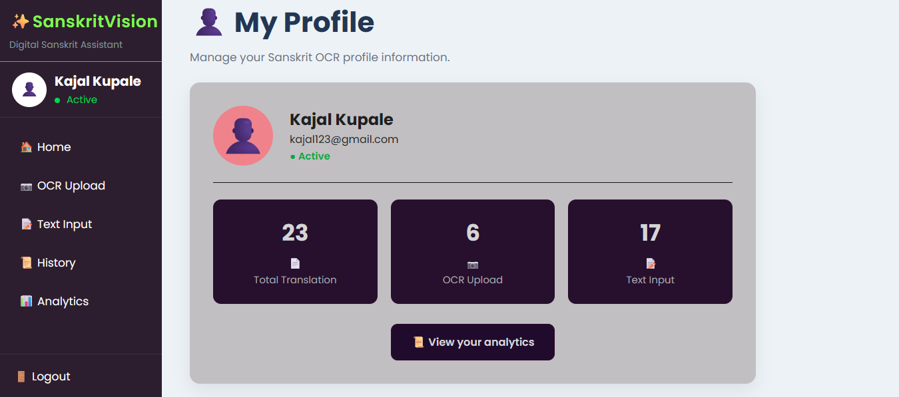

<div align="center">

# ✨SanskritVision
### AI-Powered Sanskrit OCR & Intelligent Translation System

<p align="center">
An AI-powered web application for extracting Sanskrit text from images, translating it into multiple languages, analyzing translation history, and generating intelligent reports.
</p>


</div>

---

# 📖 Project Description

**SanskritVision** is an AI-powered web application which is the system combines **Optical Character Recognition (OCR)**, **Artificial Intelligence**, and **Multilingual Translation** into one intelligent platform.

Users can upload Sanskrit text images or directly paste Sanskrit text, translate the extracted content into multiple languages, maintain translation history, visualize analytics, and generate downloadable reports through a modern web interface.

---

# 🎯 Project Objectives

- 📜 Extract Sanskrit text from images using OCR
- 🌍 Translate Sanskrit into multiple languages
- 🤖 Integrate Artificial Intelligence for better translation quality
- 📊 Analyze translation activities through interactive charts
- 📁 Store translation history
- 📄 Generate downloadable analysis reports
- 💻 Provide a clean and user-friendly interface

---

# 👥 Target Users
- Students: Learn and understand Sanskrit literature.
- Faculty & Researchers: Preserve ancient Sanskrit documents.
- Educational Institutions: AI-assisted language education.
- Sanskrit Enthusiasts: Improve accessibility to Sanskrit knowledge.
---

## ⚙️ Core Working

### 📷 OCR Text Extraction
Extracts printed Sanskrit text from uploaded images using **Tesseract OCR** and image preprocessing techniques for accurate text recognition.

---

### 🤖 AI Translation Engine
Integrates the **Google Gemini API** to perform intelligent multilingual translation, transliteration, and contextual Sanskrit text understanding.

---

### 🌐 Multilingual Processing
Processes Sanskrit text from both image uploads and manual input, translating it into multiple target languages while preserving contextual meaning.

---

### 💾 Database Management
Stores user profiles, translation history, OCR records, and analytics data securely using **MySQL** with **SQLAlchemy ORM**.

---

### 📊 Analytics & Reporting
Generates interactive dashboards with language usage statistics, translation activity, OCR insights, and downloadable PDF analysis reports.

---

### 🔐 User Authentication
Provides secure registration, login, profile management, session handling, and user-specific translation history using Flask authentication.

---

### 💻 Responsive Web Interface
Built with **Flask, HTML, CSS, JavaScript, and Jinja2**, offering an intuitive interface for OCR, translation, analytics, and history management across devices.

# 🖥️ System Modules and Generated Outputs

## 🔐 Login Page



**Description:** Secure user authentication interface with email and password validation for accessing the SanskritVision platform.

---

## 📝 Register Page



**Description:** User registration page for creating a new account with secure credential management and profile initialization.

---

## 🏠 Dashboard



**Description:** Central dashboard providing quick navigation to OCR, translation, analytics, history, profile, and reporting modules.

---

## 📷 OCR Image Translation



**Description:** Upload Sanskrit text images to extract text using Tesseract OCR and perform AI-powered multilingual translation.

---

## 🌐 AI Translation



**Description:** Translate Sanskrit text entered manually into multiple languages using the Gemini API with intelligent language processing.

---

## 📜 Translation History



**Description:** View and search previously translated records with source type, language, timestamp, and translation details.

---

## 📊 Analytics Dashboard



**Description:** Interactive dashboard displaying OCR usage, language distribution, translation statistics, and downloadable analytical reports.

---

## 👤 User Profile



**Description:** Personalized user profile displaying account information and quick access to translation activities and system features.

---

## 🛠️ Technology Stack

### 🎨 Frontend


### ⚙️ Backend


### 🤖 OCR & Artificial Intelligence


### 📊 Reports & Visualization


### 💻 Development Tools


---


# 💻 System Requirements

## Software Requirements

- Python 3.13
- Visual Studio Code
- MySQL Server
- Tesseract OCR
- 8GB RAM (16GB recommended)


---

# ⚙️ Quick Setup

```bash
# Clone Repository
git clone https://github.com/kajal-kupale/SanskritVision-OCR-and-Intelligent-Translation-System.git

# Open Project Directory
cd SanskritVision-OCR-and-Intelligent-Translation-System

# Create Virtual Environment
python -m venv venv

# Activate Virtual Environment (Windows)
venv\Scripts\activate

# Install Dependencies
pip install -r requirements.txt

# Configure MySQL Database and Gemini API Key

# Run Application
python app.py
```

🌐 Open your browser and visit:

```
http://127.0.0.1:5000
```
---
>>>>>>> 8bef97af8e35eba6b1e8b5c3ab74b7d509005720
